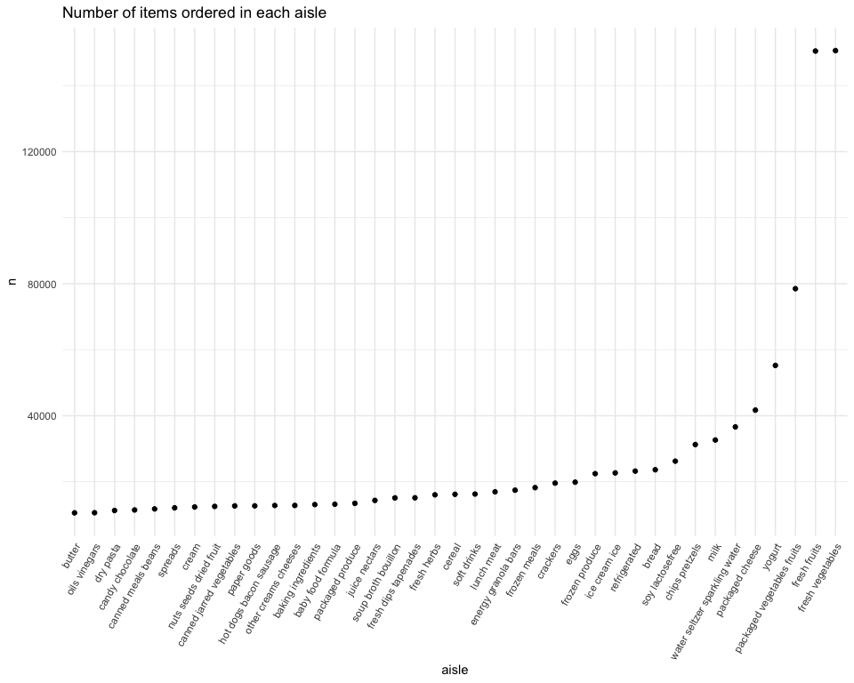
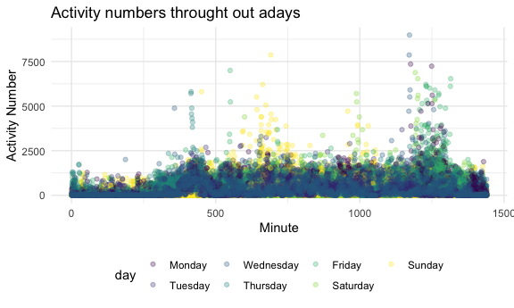
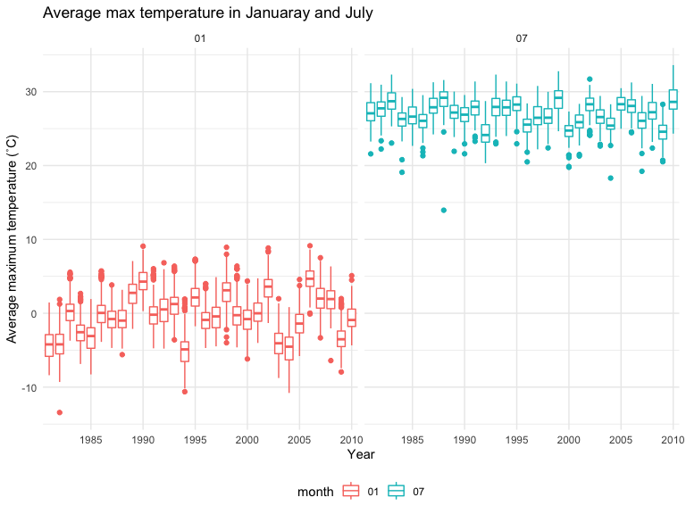
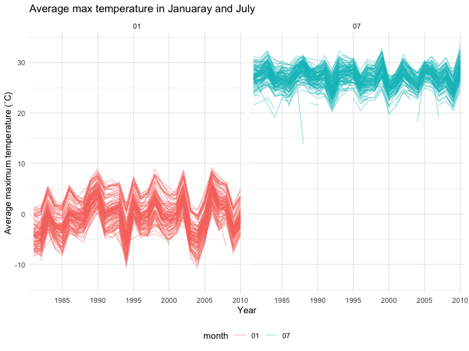
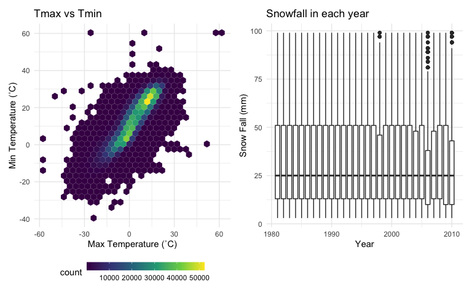

p8105_hw3_hs3393
================
Haochen Sun
2022-10-06

### Loading packages

``` r
library(tidyverse)
library(ggplot2)
library(p8105.datasets)
library(patchwork)

knitr::opts_chunk$set(
    echo = TRUE,
    warning = FALSE,
    fig.width = 8, 
  fig.height = 6,
  out.width = "90%"
)

theme_set(theme_minimal() + theme(legend.position = "bottom"))
```

## Problem 1

``` r
data("instacart")

instacart = 
  instacart %>% 
  as_tibble(instacart)
```

#### Answer questions about the data

This dataset contains 1384617 rows and 15 columns, with each row
resprenting a single product from an instacart order. Variables include
identifiers for user, order, and product; the order in which each
product was added to the cart. There are several order-level variables,
describing the day and time of the order, and number of days since prior
order. Then there are several item-specific variables, describing the
product name (e.g. Yogurt, Avocado), department (e.g. dairy and eggs,
produce), and aisle (e.g. yogurt, fresh fruits), and whether the item
has been ordered by this user in the past. In total, there are 39123
products found in 131209 orders from 131209 distinct users.

Below is a table summarizing the number of items ordered from aisle. In
total, there are 134 aisles, with fresh vegetables and fresh fruits
holding the most items ordered by far.

``` r
instacart %>% 
  count(aisle) %>% 
  arrange(desc(n))
```

    ## # A tibble: 134 × 2
    ##    aisle                              n
    ##    <chr>                          <int>
    ##  1 fresh vegetables              150609
    ##  2 fresh fruits                  150473
    ##  3 packaged vegetables fruits     78493
    ##  4 yogurt                         55240
    ##  5 packaged cheese                41699
    ##  6 water seltzer sparkling water  36617
    ##  7 milk                           32644
    ##  8 chips pretzels                 31269
    ##  9 soy lactosefree                26240
    ## 10 bread                          23635
    ## # … with 124 more rows

Next is a plot that shows the number of items ordered in each aisle.
Here, aisles are ordered by ascending number of items.

``` r
instacart %>% 
  count(aisle) %>% 
  filter(n > 10000) %>% 
  mutate(aisle = fct_reorder(aisle, n)) %>% 
  ggplot(aes(x = aisle, y = n)) + 
  geom_point() + 
  labs(title = "Number of items ordered in each aisle") +
  theme(axis.text.x = element_text(angle = 60, hjust = 1))
```



Our next table shows the three most popular items in aisles
`baking ingredients`, `dog food care`, and `packaged vegetables fruits`,
and includes the number of times each item is ordered in your table.

``` r
instacart %>% 
  filter(aisle %in% c("baking ingredients", "dog food care", "packaged vegetables fruits")) %>%
  group_by(aisle) %>% 
  count(product_name) %>% 
  mutate(rank = min_rank(desc(n))) %>% 
  filter(rank < 4) %>% 
  arrange(desc(n)) %>%
  knitr::kable()
```

| aisle                      | product_name                                  |    n | rank |
|:---------------------------|:----------------------------------------------|-----:|-----:|
| packaged vegetables fruits | Organic Baby Spinach                          | 9784 |    1 |
| packaged vegetables fruits | Organic Raspberries                           | 5546 |    2 |
| packaged vegetables fruits | Organic Blueberries                           | 4966 |    3 |
| baking ingredients         | Light Brown Sugar                             |  499 |    1 |
| baking ingredients         | Pure Baking Soda                              |  387 |    2 |
| baking ingredients         | Cane Sugar                                    |  336 |    3 |
| dog food care              | Snack Sticks Chicken & Rice Recipe Dog Treats |   30 |    1 |
| dog food care              | Organix Chicken & Brown Rice Recipe           |   28 |    2 |
| dog food care              | Small Dog Biscuits                            |   26 |    3 |

Finally is a table showing the mean hour of the day at which Pink Lady
Apples and Coffee Ice Cream are ordered on each day of the week. This
table has been formatted in an untidy manner for human readers. Pink
Lady Apples are generally purchased slightly earlier in the day than
Coffee Ice Cream, with the exception of day 5.

``` r
instacart %>%
  filter(product_name %in% c("Pink Lady Apples", "Coffee Ice Cream")) %>%
  group_by(product_name, order_dow) %>%
  summarize(mean_hour = mean(order_hour_of_day)) %>%
  spread(key = order_dow, value = mean_hour) %>%
  knitr::kable(digits = 2)
```

    ## `summarise()` has grouped output by 'product_name'. You can override using the
    ## `.groups` argument.

| product_name     |     0 |     1 |     2 |     3 |     4 |     5 |     6 |
|:-----------------|------:|------:|------:|------:|------:|------:|------:|
| Coffee Ice Cream | 13.77 | 14.32 | 15.38 | 15.32 | 15.22 | 12.26 | 13.83 |
| Pink Lady Apples | 13.44 | 11.36 | 11.70 | 14.25 | 11.55 | 12.78 | 11.94 |

## Problem 2

``` r
data <- read_csv("data/accel_data.csv") %>% 
  janitor::clean_names() %>% 
  pivot_longer(activity_1:activity_1440, 
               names_to = "minute", 
               names_prefix = "activity_",
               values_to = "activity_num") %>% 
  mutate(minute = as.numeric(minute)) %>% 
  mutate(wknd = if_else(
    day == "Sunday" | day == "Saturday", 
          true = "weekend", false = "weekday")) %>% 
  mutate(week = as.factor(week)) %>% 
  mutate(day_id = as.factor(day_id)) %>% 
  mutate(day = forcats::fct_relevel(day, 
        c("Monday", "Tuesday", "Wednesday","Thursday", "Friday",
          "Saturday", "Sunday"))
         ) %>% 
  mutate(wknd = forcats::fct_relevel(wknd, 
        c("weekday", "weekend")))
```

The variables in the dataset include: week, indicating in which week the
data is collected. day_id, showing on which day during the 35 days
experiment the data is collected. Day variable shows what the associate
day is in a week. Minute means the data collecting time in one day start
from midnight. Activity num shows the number of activities detected
during the observation period. Wknd is a binary variable indicating
whether or not the associate day be weekday or weekend.

There are 50400 observations in the dataset and 6 variables.

## Generating tables

``` r
data %>% 
  group_by(day_id) %>% 
  summarise(sum_act = sum(activity_num)) %>% 
  knitr::kable(digits = 1)
```

| day_id |  sum_act |
|:-------|---------:|
| 1      | 480542.6 |
| 2      |  78828.1 |
| 3      | 376254.0 |
| 4      | 631105.0 |
| 5      | 355923.6 |
| 6      | 307094.2 |
| 7      | 340115.0 |
| 8      | 568839.0 |
| 9      | 295431.0 |
| 10     | 607175.0 |
| 11     | 422018.0 |
| 12     | 474048.0 |
| 13     | 423245.0 |
| 14     | 440962.0 |
| 15     | 467420.0 |
| 16     | 685910.0 |
| 17     | 382928.0 |
| 18     | 467052.0 |
| 19     | 371230.0 |
| 20     | 381507.0 |
| 21     | 468869.0 |
| 22     | 154049.0 |
| 23     | 409450.0 |
| 24     |   1440.0 |
| 25     | 260617.0 |
| 26     | 340291.0 |
| 27     | 319568.0 |
| 28     | 434460.0 |
| 29     | 620860.0 |
| 30     | 389080.0 |
| 31     |   1440.0 |
| 32     | 138421.0 |
| 33     | 549658.0 |
| 34     | 367824.0 |
| 35     | 445366.0 |

No obvious trend is observed based on only day_id.

#### Generating plots

``` r
data %>%
  ggplot(aes(x = minute, y = activity_num, color = day)) +
  geom_point(alpha = .3) +
  theme_minimal() +
  theme(legend.position = "bottom") +
  labs(x = "Minute",
       y = "Activity Number",
       title = "Activity numbers throught out adays") + 
  viridis::scale_color_viridis(
    name = "day",
    discrete = TRUE
  )
```



The activity have some patterns: 1) Most of the time, the activity
numbers in one minute is less than 2,500. 2) There are some peaks of
activity number. The peaks are at 450 minutes (7:30 am), 600 minutes
(10:00 am), 1000 minutes(4:30 pm) 1250 minutes (8: 50 pm). The activity
number in the midnight (0:00 am - 4:30 am) is the lowest in one day.

## Problem 3

``` r
data("ny_noaa")
head(ny_noaa)
```

    ## # A tibble: 6 × 7
    ##   id          date        prcp  snow  snwd tmax  tmin 
    ##   <chr>       <date>     <int> <int> <int> <chr> <chr>
    ## 1 US1NYAB0001 2007-11-01    NA    NA    NA <NA>  <NA> 
    ## 2 US1NYAB0001 2007-11-02    NA    NA    NA <NA>  <NA> 
    ## 3 US1NYAB0001 2007-11-03    NA    NA    NA <NA>  <NA> 
    ## 4 US1NYAB0001 2007-11-04    NA    NA    NA <NA>  <NA> 
    ## 5 US1NYAB0001 2007-11-05    NA    NA    NA <NA>  <NA> 
    ## 6 US1NYAB0001 2007-11-06    NA    NA    NA <NA>  <NA>

The dataset describes the weather data of New York collected by NOAA
National Climatic Data Center. The dataset includes: id, showing the
weather station ID. Date, shows the date of observation. Prcp:
pricipitation (tenths of mm). Snow: snowfall (mm). Snwd: snow depth.
Tmax: maximum temperature (tenths of degree). Tmin: minimum temperature
(tenths of degree).

The size of the dataset is 2595176 rows \* 7. The proportion of NA in
the last five columns (which contains numeric data) is 0.2611. So more
than 25% data is NA, that’s a severe problem.

#### Data cleaning

``` r
datany <- ny_noaa %>% 
  separate(date, into = c("year", "month", "day"), sep = "-", remove = T) %>% 
  mutate_at(c("tmax", "tmin"), as.numeric) %>% 
  mutate(tmax = tmax / 10,
         tmin = tmin / 10,
         prcp = prcp / 10)

getmode <- function(v) {
   uniqv <- unique(v)
   uniqv[which.max(tabulate
    (match(v, uniqv)))]
}

getmode(pull(datany, snow))
```

    ## [1] 0

The most commonly observed value is 0, because for most of the time in a
year, it will not snow (except winter),

``` r
data1_7 <- datany %>% 
  filter(month == "01" | month == "07") %>% 
  group_by(id, year ,month) %>% 
  summarize(ave_max = mean(tmax))
```

    ## `summarise()` has grouped output by 'id', 'year'. You can override using the
    ## `.groups` argument.

``` r
data1_7 %>% 
  ggplot(aes(x = year, y = ave_max, color = month)) +
  geom_boxplot() +
  facet_grid(. ~ month) + 
  labs(x = "Year",
       y = "Average maximum temperature (˚C)", 
    title = "Average max temperature in Januaray and July") + 
  scale_x_discrete(breaks = c("1985", "1990", "1995", 
    "2000", "2005", "2010"))
```



``` r
data1_7 %>% 
  ggplot(aes(x = year, y = ave_max, group = id,color = month)) +
  geom_line(alpha = .4) +
  facet_grid(. ~ month) + 
  labs(x = "Year",
       y = "Average maximum temperature (˚C)", 
    title = "Average max temperature in Januaray and July") + 
  scale_x_discrete(breaks = c("1985", "1990", "1995", 
    "2000", "2005", "2010"))
```



(To see the pattern clearer, I created another line plot for this
problem) We can see that the variation of tmax in January is larger than
that in July. There are highs and lows of the maximum temperature
throughout history. The highest temperature in the summer and winter in
the past 30 years does not change significantly. There are to some
extend some outliers. Januaray have outliers higher and lower than
normal, and for July, most of the outliers are lower than average.

``` r
p_minmax = datany %>% 
  dplyr::select(tmax, tmin) %>% 
  ggplot(aes(x = tmin, y = tmax)) +
  geom_hex() +
  scale_fill_viridis_c()+
  guides(fill = guide_colourbar(barwidth = 10,   barheight = 0.7)) + 
  labs(title = "Tmax vs Tmin",
       x = "Max Temperature (˚C)",
       y = "Min Temperature (˚C)")

p_snow = datany %>% 
  filter(snow > 0 & snow < 100) %>% 
  ggplot(aes(x = year, y = snow)) +
  geom_boxplot() + 
  labs(x = "Year", 
       y = "Snow Fall (mm)",
       title = "Snowfall in each year") +
  scale_x_discrete(breaks = c("1981","1985", "1990", "1995", 
    "2000", "2005", "2010"))
  
p_merge = p_minmax + p_snow

p_merge
```


