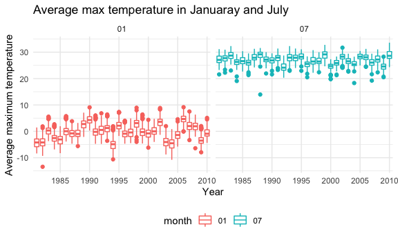
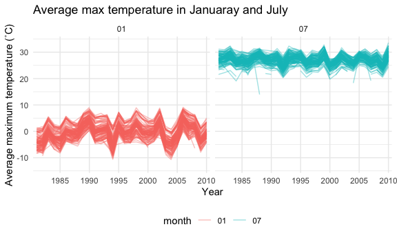
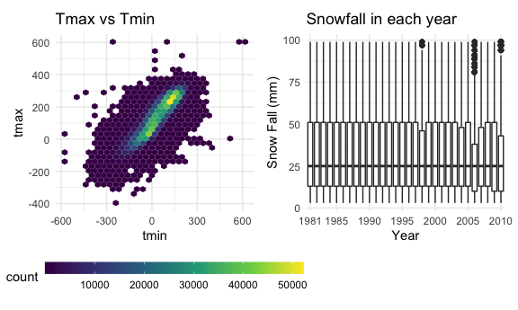

p8105_hw3_hs3393
================
Haochen Sun
2022-10-06

### Loading packages

``` r
library(tidyverse)
library(ggplot2)
library(p8105.datasets)
library(patchwork)

knitr::opts_chunk$set(
  fig.width = 6,
  fig.asp = .6,
  out.width = "50%"
)

theme_set(theme_minimal() + theme(legend.position = "bottom"))
```

## Problem 2

``` r
data <- read_csv("data/accel_data.csv") %>% 
  janitor::clean_names() %>% 
  pivot_longer(activity_1:activity_1440, 
               names_to = "minute", 
               names_prefix = "activity_",
               values_to = "activity_num") %>% 
  mutate(minute = as.numeric(minute)) %>% 
  mutate(wknd = if_else(
    day == "Sunday" | day == "Saturday", 
          true = "weekend", false = "weekday")) %>% 
  mutate(week = as.factor(week)) %>% 
  mutate(day_id = as.factor(day_id)) %>% 
  mutate(day = forcats::fct_relevel(day, 
        c("Monday", "Tuesday", "Wednesday","Thursday", "Friday",
          "Saturday", "Sunday"))
         ) %>% 
  mutate(wknd = forcats::fct_relevel(wknd, 
        c("weekday", "weekend")))
```

The variables in the dataset include: week, indicating in which week the
data is collected. day_id, showing on which day during the 35 days
experiment the data is collected. Day variable shows what the associate
day is in a week. Minute means the data collecting time in one day start
from midnight. Activity num shows the number of activities detected
during the observation period. Wknd is a binary variable indicating
whether or not the associate day be weekday or weekend.

There are 50400 observations in the dataset and 6 variables.

## Generating tables

``` r
data %>% 
  group_by(day_id) %>% 
  summarise(sum_act = sum(activity_num)) %>% 
  knitr::kable(digits = 1)
```

| day_id |  sum_act |
|:-------|---------:|
| 1      | 480542.6 |
| 2      |  78828.1 |
| 3      | 376254.0 |
| 4      | 631105.0 |
| 5      | 355923.6 |
| 6      | 307094.2 |
| 7      | 340115.0 |
| 8      | 568839.0 |
| 9      | 295431.0 |
| 10     | 607175.0 |
| 11     | 422018.0 |
| 12     | 474048.0 |
| 13     | 423245.0 |
| 14     | 440962.0 |
| 15     | 467420.0 |
| 16     | 685910.0 |
| 17     | 382928.0 |
| 18     | 467052.0 |
| 19     | 371230.0 |
| 20     | 381507.0 |
| 21     | 468869.0 |
| 22     | 154049.0 |
| 23     | 409450.0 |
| 24     |   1440.0 |
| 25     | 260617.0 |
| 26     | 340291.0 |
| 27     | 319568.0 |
| 28     | 434460.0 |
| 29     | 620860.0 |
| 30     | 389080.0 |
| 31     |   1440.0 |
| 32     | 138421.0 |
| 33     | 549658.0 |
| 34     | 367824.0 |
| 35     | 445366.0 |

No obvious trend is observed based on only day_id.

#### Generating plots

``` r
data %>%
  ggplot(aes(x = minute, y = activity_num, color = day)) +
  geom_point(alpha = .3) +
  theme_minimal() +
  theme(legend.position = "bottom") +
  labs(x = "Minute",
       y = "Activity Number",
       title = "Activity numbers throught out adays") + 
  viridis::scale_color_viridis(
    name = "day",
    discrete = TRUE
  )
```


The activity have some patterns: 1) Most of the time, the activity
numbers in one minute is less than 2,500. 2) There are some peaks of
activity number. The peaks are at 450 minutes (7:30 am), 600 minutes
(10:00 am), 1000 minutes(4:30 pm) 1250 minutes (8: 50 pm). The activity
number in the midnight (0:00 am - 4:30 am) is the lowest in one day.

## Problem 3

``` r
data("ny_noaa")
head(ny_noaa)
```

    ## # A tibble: 6 × 7
    ##   id          date        prcp  snow  snwd tmax  tmin 
    ##   <chr>       <date>     <int> <int> <int> <chr> <chr>
    ## 1 US1NYAB0001 2007-11-01    NA    NA    NA <NA>  <NA> 
    ## 2 US1NYAB0001 2007-11-02    NA    NA    NA <NA>  <NA> 
    ## 3 US1NYAB0001 2007-11-03    NA    NA    NA <NA>  <NA> 
    ## 4 US1NYAB0001 2007-11-04    NA    NA    NA <NA>  <NA> 
    ## 5 US1NYAB0001 2007-11-05    NA    NA    NA <NA>  <NA> 
    ## 6 US1NYAB0001 2007-11-06    NA    NA    NA <NA>  <NA>

The dataset describes the weather data of New York collected by NOAA
National Climatic Data Center. The dataset includes: id, showing the
weather station ID. Date, shows the date of observation. Prcp:
pricipitation (tenths of mm). Snow: snowfall (mm). Snwd: snow depth.
Tmax: maximum temperature (tenths of degree). Tmin: minimum temperature
(tenths of degree).

The size of the dataset is 2595176 rows \* 7. The proportion of NA in
the last five columns (which contains numeric data) is 0.2611. So more
than 25% data is NA, that’s a severe problem.

#### Data cleaning

``` r
datany <- ny_noaa %>% 
  separate(date, into = c("year", "month", "day"), sep = "-", remove = T) %>% 
  mutate_at(c("tmax", "tmin"), as.numeric)

getmode <- function(v) {
   uniqv <- unique(v)
   uniqv[which.max(tabulate
    (match(v, uniqv)))]
}

getmode(pull(datany, snow))
```

    ## [1] 0

The most commonly observed value is 0, because for most of the time in a
year, it will not snow (except winter),

``` r
data1_7 <- datany %>% 
  filter(month == "01" | month == "07") %>% 
  group_by(id, year ,month) %>% 
  summarize(ave_max = mean(tmax/10))
```

    ## `summarise()` has grouped output by 'id', 'year'. You can override using the
    ## `.groups` argument.

``` r
data1_7 %>% 
  ggplot(aes(x = year, y = ave_max, color = month)) +
  geom_boxplot() +
  facet_grid(. ~ month) + 
  labs(x = "Year",
       y = "Average maximum temperature", 
    title = "Average max temperature in Januaray and July") + 
  scale_x_discrete(breaks = c("1985", "1990", "1995", 
    "2000", "2005", "2010"))
```

    ## Warning: Removed 7058 rows containing non-finite values (stat_boxplot).



``` r
data1_7 %>% 
  ggplot(aes(x = year, y = ave_max, group = id,color = month)) +
  geom_line(alpha = .4) +
  facet_grid(. ~ month) + 
  labs(x = "Year",
       y = "Average maximum temperature (˚C)", 
    title = "Average max temperature in Januaray and July") + 
  scale_x_discrete(breaks = c("1985", "1990", "1995", 
    "2000", "2005", "2010"))
```

    ## Warning: Removed 6007 row(s) containing missing values (geom_path).



(To see the pattern clearer, I created another line plot for this
problem) We can see that the variation of tmax in January is larger than
that in July. There are highs and lows of the maximum temperature
throughout history. The highest temperature in the summer and winter in
the past 30 years does not change significantly. There are to some
extend some outliers. Januaray have outliers higher and lower than
normal, and for July, most of the outliers are lower than average.

``` r
p_minmax = datany %>% 
  select(tmax, tmin) %>% 
  ggplot(aes(x = tmin, y = tmax)) +
  geom_hex() +
  scale_fill_viridis_c()+
  guides(fill = guide_colourbar(barwidth = 15,       barheight = 0.7)) + 
  labs(title = "Tmax vs Tmin")

p_snow = datany %>% 
  filter(snow > 0 & snow < 100) %>% 
  ggplot(aes(x = year, y = snow)) +
  geom_boxplot() + 
  labs(x = "Year", 
       y = "Snow Fall (mm)",
       title = "Snowfall in each year") +
  scale_x_discrete(breaks = c("1981","1985", "1990", "1995", 
    "2000", "2005", "2010"))
  
  

p_merge = p_minmax + p_snow

p_merge
```

    ## Warning: Removed 1136276 rows containing non-finite values (stat_binhex).


